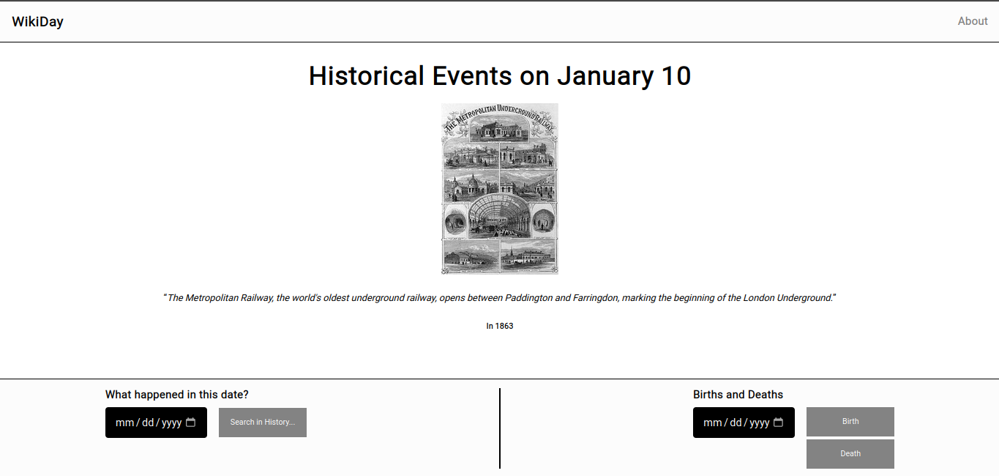

<p align="center">
  
</p>

<h3 align="center">WikiDay</h3>
  
  <p align="center">
    Exercising API with Historical Events.
    <br />
    <a href="https://github.com/melogtm/wikiday"><strong>Explore the docs »</strong></a>
    <br />
    <br />
    <a href="https://github.com/melogtm/wikiday">View Demo</a>
    ·
    <a href="https://github.com/melogtm/wikiday/issues">Report Bug</a>
    ·
    <a href="https://github.com/melogtm/wikiday/issues">Request Feature</a>
  </p>
</div>

<details>
  <summary>Table of Contents</summary>
  <ol>
    <li>
      <a href="#getting-started">Getting Started</a>
      <ul>
        <li><a href="#prerequisites">Prerequisites</a></li>
        <li><a href="#installation">Installation</a></li>
      </ul>
    </li>
  </ol>
</details>


<!-- GETTING STARTED -->
## Getting Started

### Prerequisites
* nodejs
* npm
  ```sh
  npm install npm@latest -g
  ```

### Installation

1. Clone the repo
   ```sh
   git clone https://github.com/melogtm/wikiday
   ```
2. Install NPM packages
   ```sh
   npm install
   ```
3. Run server, you can set up another port if ```3000``` is being used
   ```sh
   node index.js
   ```

<p align="right">(<a href="#readme-top">back to top</a>)</p>
